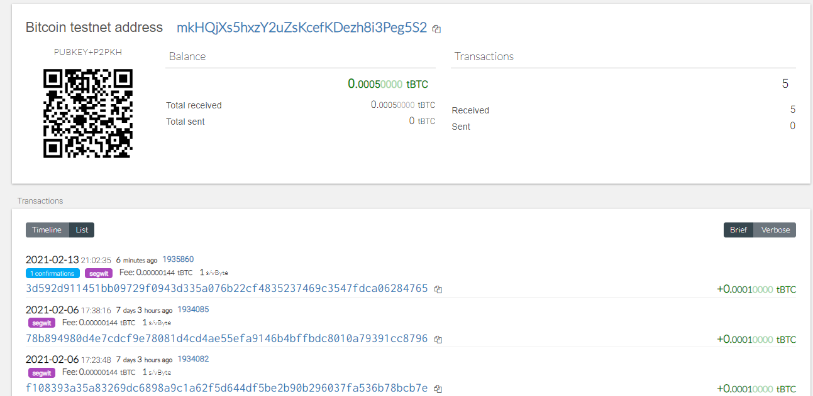

# Multi-Blockchain Wallet in Python
### Unit 19 Homework

In this homework, I am building a multiblockchain wallet for our startup. To do this, I will be using a command line tool called hd-wallet-derive that supports BIP32, BIP39, and BIP44. I will also be integrating my wallet with Python to manage different cryptocurrencies. 

## Deriving Wallet Keys

In this section, I used a mnemonic to generate wallet addresses for different cryptocurrencies. Then I created a function called "derive_wallets" that uses the subprocess python library to call our wallets into python. I then put all the addresses and keys from BTC, ETH and BTCTEST into a dictionary called coins. See below output (I limited the number of keys to 3 per crypto and blocked out the private key).

## Linking Transaction Libraries

Then I created 3 functions to be able to manage my crytocurrencies using python.  For this example, I used only ETH and BTCTEST cryptocurrencies. Note that ETH and BTCTEST have different libraries that connect it to python so I used if/elif statements so I can use the same function to connect to either my ETH or BTCTEST wallets. See my pythong code here:  [Python file with  functions](https://github.com/nikanikachan/Wallet/blob/main/wallet_hw19.py).

Description of functions created:

- `priv_key_to_account` : gets the private key for each account

- `create_tx` : creates the raw transaction metadata to able to send transactions

- `send_tx`: signs the transaction and broadcasts it to the network

### Bitcoin Testnet transaction

For Bitcoin testnet, I had to get bitcoins from a faucet to have funds in my BTC testnet wallet to send. I got my bitcoins from this link: [Bitcoin Faucet](https://bitcoinfaucet.uo1.net/). After receiving the bitcoin from the faucet, we can trace the related transactions using the hash as seen below.

Then I used the command line in my computer to run python functions to send a test transaction to another bitcoin testnet address. See python file I called in my command line here:[Bitcoin Testnet Python file](https://github.com/nikanikachan/Wallet/blob/main/btc_txn.py). Unfortunately, I have insufficient funds to send a transaction because of the unusually high gasprice at the time of sending. See below screenshot:

The takeaway though is that I can send Bitcoin transactions using python and in my command line. I did not need to go through MyCrypto to do this. 

### Local PoA Ethereum transaction

I also tested the code we created in python to create transactions in our ETH PoA network. First, I had to prefund it with ETH so we I send a transaction. Then I used the functions `priv_key_to_account`, `create_tx` and `send_tx` to send a transaction using python. See below image to see the generated transaction hash in python. 

 Then I used the resulting hash from above to check the transaction in MyCrytpo.  

 

Unfortunately, my local nodes were not mining properly and the transaction is still Pending, but we can see that the python code that we used was able to send a transaction in the blockchain and we can trace it with the hash that was generated in the file. See this python file for full code. [Python file for code](https://github.com/nikanikachan/Wallet/blob/main/wallet_hw19.py)

----------------------

## Dependencies

- Creating wallet addresses. Use this link, remember to download it to your computer and open it in your browser for better secruity: [Mnemonic Code Converter](https://iancoleman.io/bip39/)

- To create an HD wallet derive symlink  that will link your multi-cryptocurrency wallet to python, use the following commands:
    1. cd into your hd-wallet-derive folder
    2. use this command in command line `export MSYS=winsymlinks:nativestric`
    3. cd back out `cd ..`
    4. use this command in command line `ln -s hd-wallet-derive/hd-wallet-derive.php derive`

    